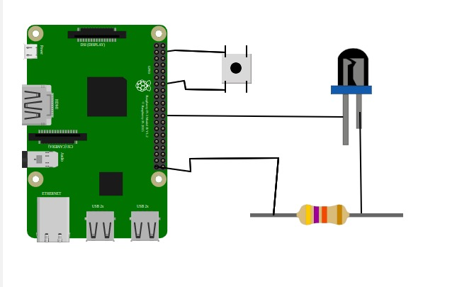

#### **Hardware Setup**

1. **Connect the Push Button:**
   - Connect any of the push button's pins to any of the GPIO pins of the Raspberry Pi.
   - Connect the other pin of the button to any of the GND pins of the Raspberry Pi.

2. **Connect the LED:**
   - Connect any of the GPIO pins of the Raspberry Pi to the LED’s anode pin (longer leg).

3. **Connect the Resistor:**
   - Since the pin requires low voltage, connect any of the resistor's pins to the LED’s cathode (shorter leg).
   - Connect the other pin of the resistor to any of the GND pins of the Raspberry Pi.

4. **Testing the Circuit:**
   - Click the push button to verify that the LED turns **ON**.


 Enter the GPIO pin number of the button and LED in the code section.  
 The code section can be opened by clicking the **Code** button on the upper-right side of the simulation area.

<div></div>


#### **Software Setup**

1. Install **Thonny IDE** or any Python IDE that supports GPIO programming for Raspberry Pi.
2. Make sure **Python** and the **RPi.GPIO** library are installed on your Raspberry Pi.
3. Open Thonny and create a new Python file named `led_button.py`.
4. Copy and paste the Python code (shown below) into the file.
5. Save the file and run it. You will be prompted to enter GPIO pin numbers.
6. After running, press the push button to test if the LED turns on/off correctly.


#### **Python Code**

Below is the Python script to monitor the button’s state and control the LED accordingly:

```python
import RPi.GPIO as GPIO
import time

# Define GPIO pin numbers
button = int(input("Enter the GPIO pin number for the button: "))
led = int(input("Enter the GPIO pin number for the LED: "))

def setup():
    """Initialize GPIO modes and configure pins."""
    GPIO.setmode(GPIO.BOARD)
    GPIO.setup(button, GPIO.IN, pull_up_down=GPIO.PUD_UP)
    GPIO.setup(led, GPIO.OUT)

def loop():
    """Continuously monitor button state and control LED."""
    while True:
        button_state = GPIO.input(button)
        if button_state == False:
            GPIO.output(led, True)
            print('Button Pressed...')
            while GPIO.input(button) == False:
                time.sleep(0.2)
        else:
            GPIO.output(led, False)

def endprogram():
    """Cleanup GPIO settings before exiting."""
    GPIO.output(led, False)
    GPIO.cleanup()

# Main execution
if __name__ == '__main__':
    setup()
    try:
        loop()
    except KeyboardInterrupt:
        print("Keyboard Interrupt detected. Exiting...")
        endprogram()
