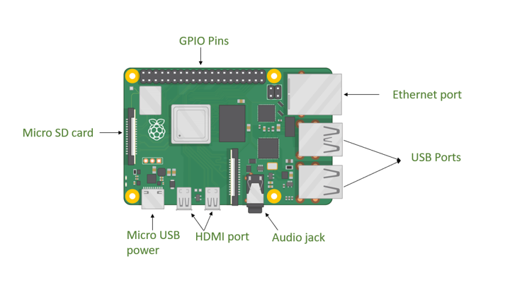

### Theory

#### Introduction
The Raspberry Pi is a powerful, compact single-board computer that allows users to interact with external hardware components through its General Purpose Input/Output (GPIO) pins. These pins can be configured as inputs or outputs, enabling you to detect signals from components like buttons and control devices like LEDs. This experiment demonstrates how to interface a push button with the Raspberry Pi, allowing it to detect button presses and control an LED based on the input.

The experiment introduces the fundamental concepts of digital input/output, GPIO pin configuration, and simple Python programming to handle button states. This setup forms the basis for building more complex embedded systems and automation projects using the Raspberry Pi.

#### Components Required

#### 1. **Raspberry Pi**
The Raspberry Pi is a small, versatile computer designed for learning and prototyping. It features **GPIO pins** that allow it to interface with various electronic components. For this experiment, you will use the GPIO pins to detect button presses and control an LED.

#### 2. **Push Button**
A push button is a simple mechanical switch that can either be open (not pressed) or closed (pressed). When pressed, it completes the circuit and sends a signal to the Raspberry Pi’s GPIO input pin.

### 3. **LED (Light Emitting Diode)**
An LED is a semiconductor device that emits light when current flows through it. In this experiment, the LED will indicate the state of the button press, turning on when the button is pressed and off when it is released.

#### 4. **Resistor**
A resistor is used to limit the current flowing through the LED, preventing damage to the LED and the Raspberry Pi’s GPIO pins. The **100Ω resistor** ensures the LED receives a safe amount of current.

#### Circuit Connections

1. **Connecting the Push Button and LED:**
   - **Push Button:** Connect one leg of the push button to a **GPIO input pin** (e.g., GPIO17). Connect the other leg to **ground (GND)**.
   - **LED:** Connect the longer leg (anode) of the LED to another **GPIO output pin** (e.g., GPIO18). Connect the shorter leg (cathode) to **ground** through a **100Ω resistor** to limit the current.

2. **Programming the GPIO Pins:**
   - Write a simple Python program to detect the push button state (pressed or released) and control the LED’s state (on or off). Use libraries like **RPi.GPIO** or **gpiozero** to interact with the GPIO pins.(The GPIO pins on the Raspberry Pi allow interaction with external devices. These pins can be configured as **inputs** to detect signals or **outputs** to control devices.)

